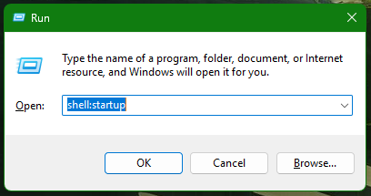
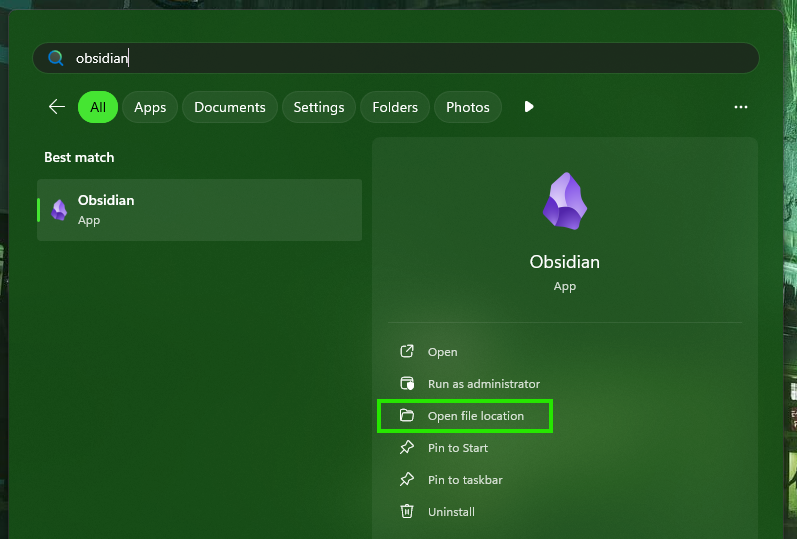
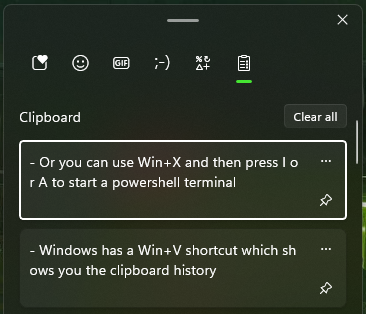

Ever since about 6 months ago I started experimenting with setting keyboard shortcuts on Windows. That leads up to today when I have my most efficient PC setup I've ever had and today I will share how to set it up with you.
The setup is as easy as it can be and it can be set up in **less than 15 minutes**, but it can make your usage of the PC more effective and easier forever! :D

## How to set this up:

If you want a custom set up like what I did, ==**Autohotkey**== **will** answer all your thoughts and prayers. This smaller programming language is actually really easy to use, if you know how!

### Here are the steps:

- <a href="https://www.autohotkey.com/" class="underline text-accent">Download autohotkey v2 here</a>
- Create a new file called _[some name].ahk_ and open it up with notepad or any text editor.
- Here is a sample script that runs excel when you press Win + E:

```
#Requires AutoHotkey v2.0

#e::
{
	Run "excel"
}
```

### What does it do?

- This script should start up excel when you press the windows key and E simultaneously!
- Double click the script to run it and test it by pressing ==Win + E==.
- If it works you can make more of those keybinds! ==You can copy the code from #e to the end bracket ==(Do not copy the #requires line. That needs to be there just once). Change the E key to any other key and change the "excel" to any other program.
- You can now modify the script however you want!
- ==Now, save this script into the folder that runs it on startup:== 1. Press Win+R (Or type "run" into the windows search) 2. Type "shell:startup" 3. Save the script here.
  
- ==This will ensure you always have these new shortcuts available==, because the script will start with your PC from now on :).
  You can now use this basic script to define custom keyboard shortcuts to open any app you want. But ==if you want to learn more about this system, the read on, because there is more coming!==

## How to truly run any app

Running an app like excel is good, ==but not good enough==. It requires the app you want to bind to some key combination to be an **explicit statement** you could write into the Windows Run Utility (the one where we wrote shell:startup earlier).
-> For example, my notetaking app is called obsidian, but ==if you try to write "obsidian", it will be unable to launch==, since not all apps have this shorter launch command defined.

### How to bind any app you have installed:

1. Press the windows key and search for the app you want to bind
2. Right click it and press "**Open file location**" 
3. Find the icon in the folder and right click it again - press "**Copy as path**"
4. You now have ==the exact path you can use to run the app from AutoHotkey==!
5. Write this path into your AutoHotkey script:

```
#o::
{
	Run "C:\ProgramData\Microsoft\Windows\Start Menu\Programs\Obsidian.lnk"
}
```

This example shows how I run the Obsidian app :D.

## How to use keys other than the windows key

Short AutoHotkey lesson incoming!
If you wanted to create a script that runs when you press o, without any windows keys, ==you would define it like so==:

```
o::
{
	Run "C:\ProgramData\Microsoft\Windows\Start Menu\Programs\Obsidian.lnk"
}
```

But that would make it impossible for you to type anything on the keyboard - which is why I used the # symbol.
The # symbol defines the windows key (Symbols like the windows key, Ctrl, Shift, etc. are also called **modifier keys**). There are ways to set other keys to be pressed with your letter on the keyboard.

### What are the modifier keys?

Here they are:

```
^o:: ; Runs the app when you press Ctrl + o
!o:: ; Alt + o
+o:: ; Shift + o
#o:: ; Win + o
```

That's not all the variations though, because you ==can also combine these modifier keys to be pressed together== - watch out though, because **the order of the key presses matter**!

```
!^o:: ; Alt + Ctrl + o
^!o:: ; Ctrl + Alt + o
```

So all in all you can use these keys, or you can ==re-bind any special keys you do not use on your PC==:

### What are some other special keys?

```
F1:: ; F1 key - you can use any of the numbered F keys
PrtScn:: ; Print Screen
Home:: ; Home key
End:: ; End key
PgUp:: ; Page Up key
PgDn:: ; Page Down key
Up::::
Down::
Left::
Right:: ; Those are the arrow keys
```

These are only some of the more useful keys you can bind scripts to. Or you can rebind any other key - <a href="https://www.autohotkey.com/docs/v2/KeyList.htm">There is a wiki for that</a>.
My favorite of these special keys are ==the F1 keys==. One use for them could be writing special characters - those ones that are not available on your keyboard, but you want to use them. But I might explain that in an another blog post :D.

## How to redefine windows keyboard shortcuts

This last little tutorial is how to ==redefine certain existing windows keyboard shortcuts==. It is a niche thing, but it's actually pretty useful, since windows has some Win+something key functionalities that you might want to keep.

### Some of the useful windows shortcuts

- Windows has a Win+V shortcut which shows you the clipboard history: 
- Or you can use Win+X and then press I or A to start a powershell terminal
  These shortcuts are handy and you may not want to get rid of them entirely, but it could happen that you ==would want to use them for something else== and rebind the windows shortcuts to different keys. For example you might like the clipboard history bound to Win+V:

### Example: Rebinding the clipboard history to Win+C

This example is showing you how you would go about re-binding the clipboard history (which is located at Win+V) to Win+C. I was specifically doing this so I could use Win+V to launch VS Code (the programming environment).

```
#c::
{
	Send "#v"
}

#v::
{
	Run "C:\Users\David\AppData\Roaming\Microsoft\Windows\Start Menu\Programs\Visual Studio Code\Visual Studio Code.lnk"
}
```

So as you can see, it is ==pretty simple and no black magic is needed==. Just rebind the original windows shortcut to the new shortcut and now you can use the original clipboard shortcut for some different key bind with all working as intended.
This works, because if you bind a shortcut to run inside autohotkey, ==the original windows shortcut will always take preference==, before running your other custom defined Win+some key shortcuts.

## What now?

That's all that I have for this tutorial on how to bind your own windows keyboard shortcuts - ==it really is that easy==. You now have everything you need so you can go :).
If this guide was helpful to you, or if you have some feedback to my blog posts, I would be glad to hear it :D. Thanks for reading!

## Extra showcase of my own autohotkey script:

In case you want to get inspired, here is my own daily autohotkey script:

```
#Requires AutoHotkey v2.0

#b::
{
    Run "C:\ProgramData\Microsoft\Windows\Start Menu\Programs\Brave.lnk"
}

#k::
{
    Run "C:\Users\David\AppData\Roaming\Microsoft\Windows\Start Menu\Programs\KiCad 8.0\KiCad 8.0.lnk"
}

#a::
{
    Run "C:\ProgramData\Microsoft\Windows\Start Menu\Programs\AIMP\AIMP.lnk"
}

#t::
{
    Run "C:\Program Files\Git\git-bash.exe --cd-to-home"
}

#d::
{
    Run "explorer"
}

#g::
{
	Run "D:\ProgramFiles\Archetype Gojira\Archetype Gojira.exe"
}

#e::
{
	Run "excel"
}

#m::
{
	Run "matlab"
}

#v::
{
	Run "C:\Users\David\AppData\Roaming\Microsoft\Windows\Start Menu\Programs\Visual Studio Code\Visual Studio Code.lnk"
}

#o::
{
	Run "C:\ProgramData\Microsoft\Windows\Start Menu\Programs\Obsidian.lnk"
}

#c::
{
	Send "#v"
}
```
