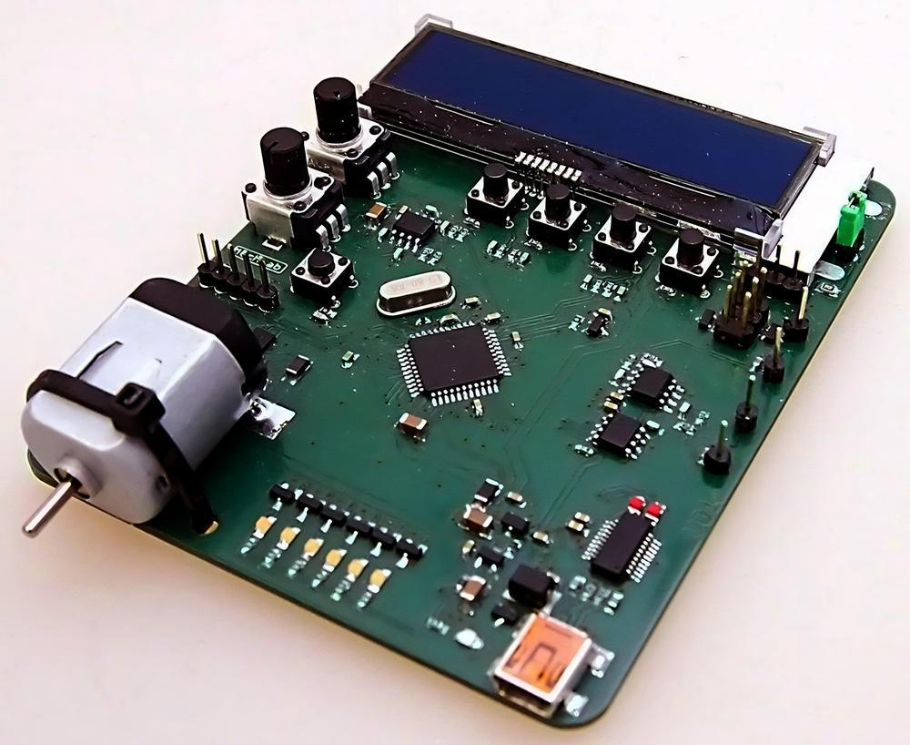

I've been able to take a course on working with embedded systems at school. The main curriculum is ==programming in the C language and programming the PIC18F46K22 processor== by MicroChip.

The whole concept of low level programming is interesting to me and I will be doing some more when possible.

The final project of this course was ==**creating 5 tasks:**==

- UART - the processor takes an input and sends it back reversed
- PWM - increment the brightness of an LED
- ADC - display the values of the two potentiometers
- DAC - generate three signals that I can display on an osciloscope on the PC
- GAME - program a game where you try to match a random number with the potentiometer value
- ==Menu - program an interface and navigation so that I can switch through the tasks==

This was probably the biggest coding project I have done in regards to ==tracking state inside a project==. So if you want to see how I did it, you can check out the code on my GitHub.

